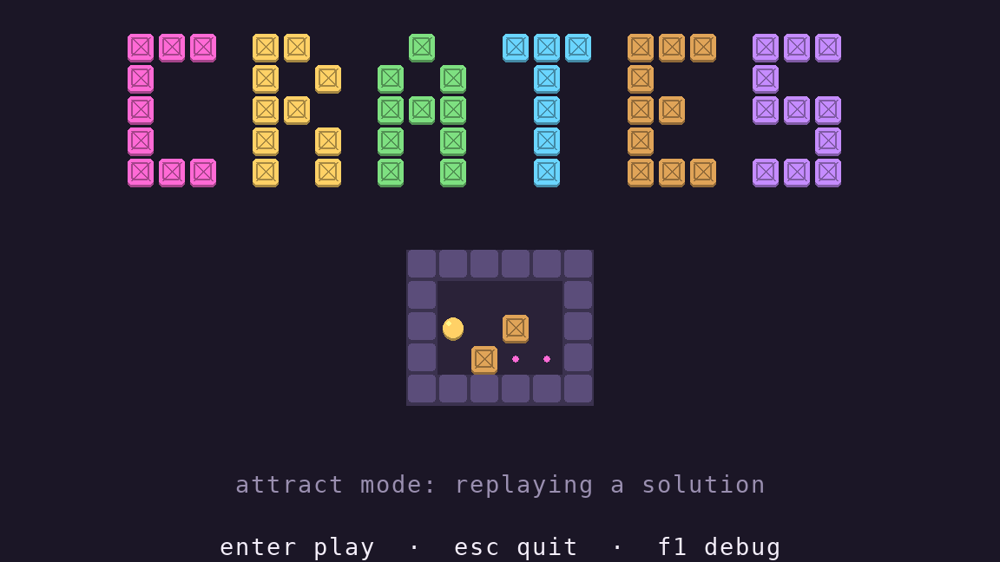
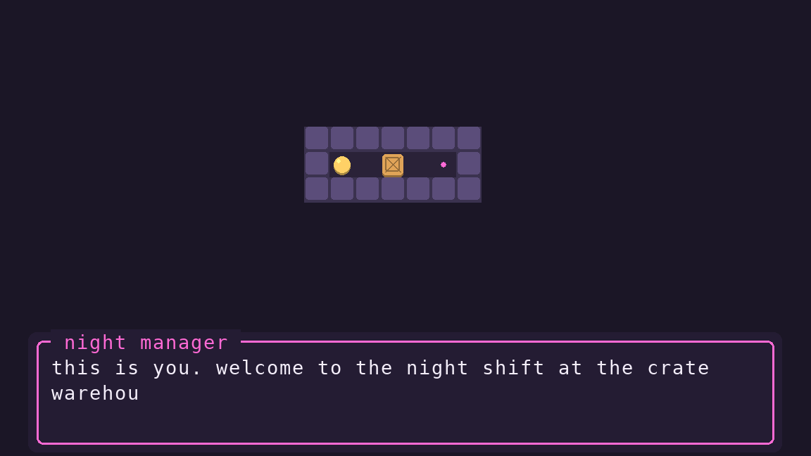
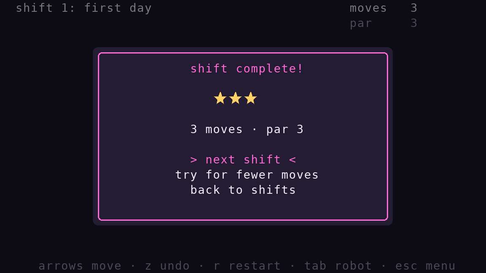
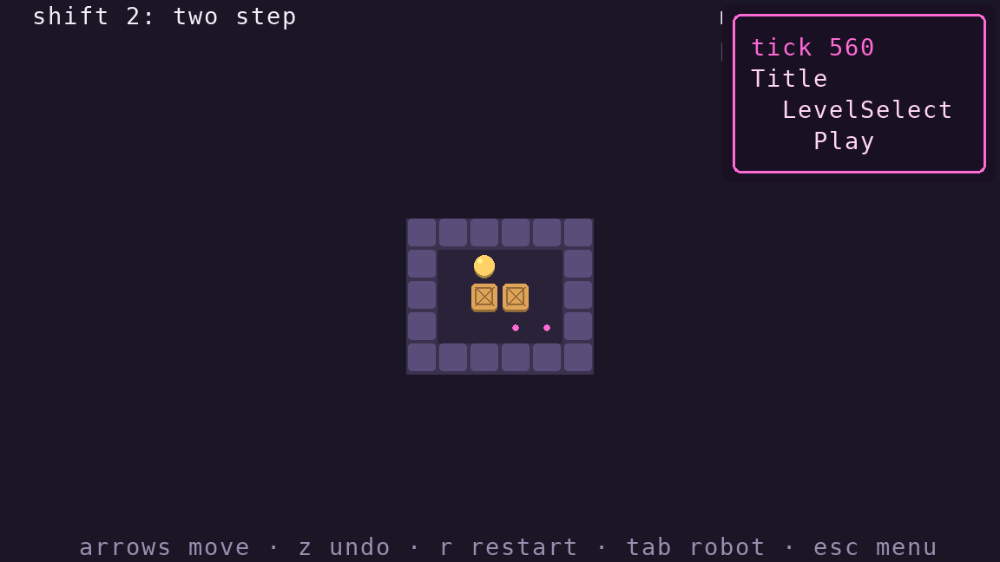

# arche

state management for small games, with the platform kept at arm's length.



Games are a stack of states. A state never touches the stack, the screen or
the keyboard. Instead it:

- **returns effects** (`Push`, `Pop`, `Set`, `Quit`) from any hook, and the stack interprets them
- **hands results back**: `Pop(result)` arrives in the state underneath as `on_resume(result)`
- **runs scripts**: a generator that yields effects, so cutscenes read top to bottom
- **describes what to show** as plain scene nodes, which a *shell* turns into pixels or characters

Because the core is pure Python and runs on a fixed timestep, a whole play
session is just a seed plus a list of `(tick, action)` pairs. Recording,
replaying and testing come for free.

```python
from arche import Pop, Push, State, Wait, on, scene as s

class Say(State):
    overlay = True                          # the state underneath keeps drawing

    def __init__(self, text):
        self.text = text

    @on('confirm')
    def close(self, _):
        return Pop()

    def view(self):
        yield s.Frame(1, 12, 30, 5, '#ff6ad5', '#241c33')
        yield s.Text(2, 13, self.text, '#f4eefa')


class Shop(State):
    def script(self):
        yield Push(Say('a sword? that will be 10 gold.'))
        if (yield Push(Confirm())):         # resumes with whatever Confirm pops
            self.gold -= 10
        yield Wait(0.5)                     # game time, so pausing pauses it
        return Pop()
```

## the demo: crates

A small Sokoban with a title screen and attract mode, a scripted intro,
level select, pause and win overlays, undo, a robot that demonstrates the
solution, and par/stars.

```sh
uv run python examples/crates                       # pygame-ce window
uv run python examples/crates --shell terminal      # same game, in your terminal
uv run python examples/crates --record run.json     # save your session
uv run python examples/crates --replay run.json     # watch it back, then take over
```

Keys: arrows/wasd/hjkl move, `z` undo, `r` restart, `tab` robot, `esc` menu,
`f1` or `` ` `` debug overlay.

| intro (a script) | win overlay (`Pop(result)`) | debug overlay |
|---|---|---|
|  |  |  |

The terminal shell renders the same nodes, two columns per cell:

```
        [][][]  [][]      []    [][][]  [][][]  [][][]
        []      []  []  []  []    []    []      []
        []      [][]    [][][]    []    [][]    [][][]
        []      []  []  []  []    []    []          []
        [][][]  []  []  []  []    []    [][][]  [][][]

                          ████████████
                          ██    ◖◗  ██
                          ██      []██
                          ██    []··██
                          ████████████
```

## in Rust too

[`rust/`](rust/) has the same library and the same game in Rust. Scripts
there are `async` blocks, driven by arche's own tiny executor:

```rust
cx.wait(0.5).await;
let answer = cx.push(Confirm::new()).await.take::<bool>();
```

## layout

```
arche/
  effects.py     Push / Pop / Set / Quit / Wait
  state.py       State, @on(action), @every(seconds)
  stack.py       the effect interpreter: lifecycle, timers, scripts, overlays
  runtime.py     fixed timestep, input log, replays, debug overlay
  scene.py       platform-neutral nodes: Clear, Fill, Frame, Tile, Text, Dim
  shells/
    pygame.py    a window (and offscreen screenshots)
    terminal.py  truecolor ANSI, plus a plain-text renderer for tests
examples/crates/ the demo
tests/
```

Writing a new shell means turning keys into action names, and scene nodes
into whatever your platform draws. A fridge works, if it has enough LEDs.

## tests

```sh
uv run pytest
```

The game tests play whole sessions headlessly, check that every level's
stored solution works (and is optimal), and check that a recorded session
replays to exactly the same frame.
