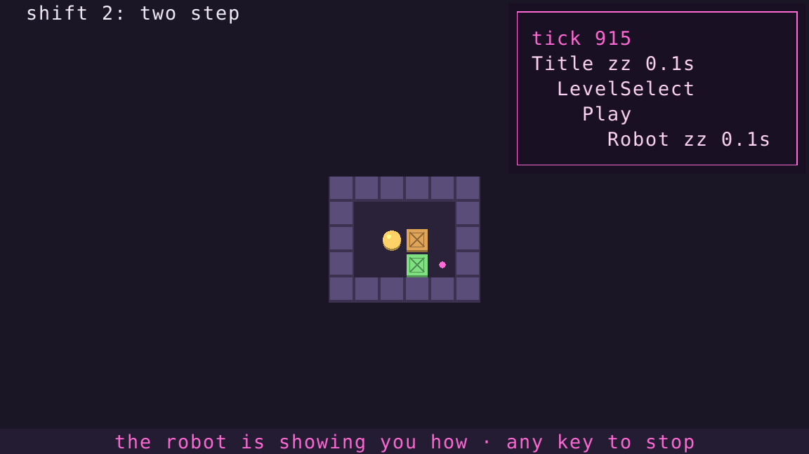

# arche, in Rust

The same idea as the Python version: a stack of states that return effects,
hand results back, run scripts, and describe frames as platform-neutral
scene nodes. Same demo too.



```sh
cargo run --release                                  # a window (macroquad)
cargo run --release -- --shell terminal --record run.txt   # in your terminal (crossterm)
cargo run --release -- --replay run.txt --shell text # replay headless, print the last frame
cargo test
```

## scripts are `async` blocks

Python has generators; stable Rust doesn't. But an `async` block is a
generator in disguise, and arche drives it with its own executor, about
50 lines with no async runtime. Each tick it polls the top state's script once.
`cx.wait(..)` and `cx.push(..)` leave a request in a mailbox and return `Pending`.
The stack resumes the script when the time has passed or the pushed state pops.

```rust
impl State for Intro {
    fn script(&mut self, cx: Cx<Self>) -> Option<Script> {
        script(async move {
            cx.wait(0.5).await;
            cx.push(Say::new("this is you. welcome to the night shift.")).await;

            for letter in LEVELS[0].solution.chars() {
                cx.wait(0.35).await;
                cx.with(|me, _| me.board = me.board.step(direction(letter)).unwrap());
            }
            Some(set(LevelSelect::new()))
        })
    }
}
```

Reaching your own state from inside the script is the Rust-specific part.
Each state lives in an `Rc<RefCell<..>>`, and `cx.with(|me, app| ..)`
borrows it (and the app) only for the length of the closure. Nothing else
holds a borrow while a script runs, so this never panics in practice. Just
don't hold a `with` across an `.await`.

## differences from the Python version

- **No `@every` timers.** A script that loops is a timer:
  `loop { cx.wait(0.2).await; cx.with(|me, _| me.tick()); }`. That's how the
  title screen's attract mode works.
- **Replies are typed.** `pop_with(Choice::Next)` sends any `'static` value,
  and the receiver asks for it with `reply.take::<Choice>()`.
- **A reply goes to one place.** If a script awaits the push, the script
  gets the reply and `on_resume` gets an empty one. Otherwise `on_resume`
  gets it. Python handed the same object to both.
- **Shared data is typed:** `app.store.get::<Progress>()` instead of a dict.
- **The RNG is built in** (SplitMix64), so replays match on every platform.
- **States can't hold references to each other.** The robot that plays a
  level's solution is its own state with its own board, which pops with
  `Choice::Restart` when it's done. In Python it reached into the level state.

## layout

```
arche/src/
  effect.rs     push / set / pop / pop_with / quit, Reply
  script.rs     Cx, wait/push futures, the mailbox
  stack.rs      the effect interpreter and the script executor
  runtime.rs    fixed timestep, input log, replays, debug overlay
  scene.rs      Node, Rgb, Kind
  shells/       text (always), terminal (crossterm), window (macroquad)
crates-demo/    the game; `cargo run -- --tour DIR` plays through it and saves screenshots
```

The core has no dependencies. The terminal and window shells are optional
features (`terminal` and `window`).
